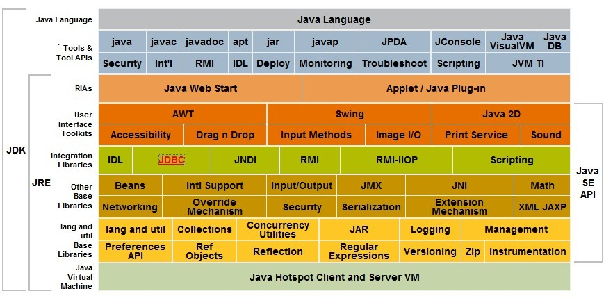

# 海量一面


## redis有哪些应用？

## redis与mysql如何保证数据一致性？

## redis底层数据结构？

## 介绍一下dubbo？

## dubbo的注册中心zk挂掉了，服务还可以正常调用么？

## mysql索引数据结构？为什么不是红黑树？

## order by group by 之后的字段加索引可以加快查询速度么？

## 什么时候索引不会命中？

```java
1、如果条件中有 or ，即使其中有条件带索引也不会使用(这也是为什么尽量少用or的原因）
注意：要想使用or，又想让索引生效，只能将or条件中的每个列都加上索引
如果出现OR的一个条件没有索引时，建议使用 union ，拼接多个查询语句
2.、like查询是以%开头，索引不会命中
只有一种情况下，只查询索引列，才会用到索引，但是这种情况下跟是否使用%没有关系的，因为查询索引列的时候本身就用到了索引
3. 如果列类型是字符串，那一定要在条件中将数据使用引号引用起来,否则不使用索引
4. 没有查询条件，或者查询条件没有建立索引
5. 查询条件中，在索引列上使用函数（+, - ,*,/）, 这种情况下需建立函数索引
6. 采用 not in, not exist
7. B-tree 索引 is null 不会走， is not null 会走
```

## HashMap put方法怎么保证key不重复？

第一段

```java
if ((p = tab[i = (n - 1) & hash]) == null)
```

这段代码其实主要是通过hash计算该元素的位置，然后判断该位置是否有值，如果没有值，那么可以直接插入，最后返回null；

第二段

```java
if (p.hash == hash && ((k = p.key) == key || (key != null && key.equals(k))))
                e = p;
```

如果通过计算，该位置上已经有其他元素，那么接下来就会通过hash和equals进行判断，判断它是不是重复元素，如果重复元素，那么最后会将这个重复元素返回。

通过第二段代码我们可以发现，判断元素是否重复，使用的是hash和equals方法进行判断的，所有我们Set里面如果存放的是对象，那么一定要重写hash和equals方法。

## HashMap为什么是线程不安全？

---------------------


# 有赞一面


## Spring Bean的生命周期？


## 讲一下spring 循环依赖？


## HashMap的put方法？


---

# 涂鸦

## Redis数据结构，如何设计？


## redission 底层原理？

redisson所有指令都通过lua脚本执行，redis支持lua脚本原子性执行

redisson设置一个key的默认过期时间为30s,如果某个客户端持有一个锁超过了30s怎么办？

redisson中有一个watchdog看门狗的概念，翻译过来就是看门狗，它会在你获取锁之后，每隔10秒帮你把key的超时时间设为30s

这样的话，就算一直持有锁也不会出现key过期了，其他线程获取到锁的问题了。

redisson的"看门狗"逻辑保证了没有死锁发生。

(如果机器宕机了，看门狗也就没了。此时就不会延长key的过期时间，到了30s之后就会自动过期了，其他线程可以获取到锁)


## RocketMQ底层


----


# 51信用卡

## IO

### BIO

1）当并发数较大时，需要创建大量线程来处理连接，系统资源占用较大；

2）连接建立后，如果当前线程暂时没有数据可读，则线程就阻塞在 Read 操作上，造成线程资源浪费

### NIO

https://blog.csdn.net/daaikuaichuan/article/details/83862311?utm_medium=distribute.pc_relevant.none-task-blog-2%7Edefault%7EBlogCommendFromMachineLearnPai2%7Edefault-1.control&depth_1-utm_source=distribute.pc_relevant.none-task-blog-2%7Edefault%7EBlogCommendFromMachineLearnPai2%7Edefault-1.control

- 
- 

1. 调用epoll_create建立一个epoll对象(在epoll文件系统中给这个句柄分配资源

2. 调用epoll_ctl向epoll对象中添加这100万个连接的套接字；

3. 调用epoll_wait收集发生事件的连接。

## 简单谈一下对多线程的理解？

## 注解的应用？

## 反射知识？

## JUC？

- AQS

- CylicBarrier

- CountDownLatch

- Semaphore

- 原子类

- fork/join框架 ---> 线程窃取，充分利用cpu资源

     

## 简单聊一聊锁？

- 修饰函数，锁的是当前类的实例化对象 this

- 修饰静态方法，锁的是当前类的Class对象  T.class

- 修饰同步代码块,锁的是括号里的对象 

    加锁实际上就是在锁对象的对象头中写入当前线程id，每个线程要想调用这个同步方法，都会先去锁对象的对象头看看当前线程id是不是自己的。

- synchronized 锁升级过程？ 四种状态

- CAS 

- 可重入锁

- reentrantLock

----


# 同花顺

## JDK，JRE，JVM 都是什么？

JDK 包含 JRE



## JVM 是什么？


栈： 虚拟机栈为虚拟机执行Java方法（也就是字节码）服务，而本地方法栈则是为虚拟机使用到的Native方法服务

堆：“此内存区域的唯一目的就是存放对象实例，几乎所有的对象实例都在这里分配内存。”

方法区：“方法区（Method Area）与Java堆一样，是各个线程共享的内存区域，它用于存储已被虚拟机加载的类信息、常量、静态变量、即时编译器编译后的代码等数据。”

运行时常量池：“运行时常量池（Runtime Constant Pool）是方法区的一部分。Class文件中除了有类的版本、字段、方法、接口等描述等信息外，还有一项信息是常量池（Constant Pool Table），用于存放编译期生成的各种字面量和符号引用，这部分内容将在类加载后存放到方法区的运行时常量池中”


## 类加载的过程?


## 对象创建的一个过程？（ JVM创建 --> GC )

- **JVM首先先去找到对象的类型信息，然后创建对象，方法有两种，一种是根据句柄，另一种是直接指针。**

    - 使用句柄：“如果使用句柄访问方式，Java堆中将会划分出一块内存来作为句柄池，reference中存储的就是对象的句柄地址，而句柄中包含了对象实例数据和类型数据各自的具体地址信息”

    - 

    - 使用直接指针：“如果使用直接指针访问方式，Java堆对象的布局中就必须考虑如何放置访问类型数据的相关信息，reference中直接存储的就是对象地址”

    - 

    - “这两种对象的访问方式各有优势，

        **句柄访问方式**的最大好处就是reference中存储的是稳定的句柄地址，在对象被移动（垃圾收集时移动对象是非常普遍的行为）时只会改变句柄中的实例数据指针，而reference本身不需要被修改。

        **直接指针访问方式**的最大好处就是速度更快，它节省了一次指针定位的时间开销，由于对象的访问在Java中非常频繁，因此这类开销积少成多后也是一项非常可观的执行成本。”

- JVM实例化一个对象，在堆中创建一个对象。

    - 对象首先会县创建在新生代的Eden区，然后经过依次minor GC，对象如果存活，移动到S区，之后每次GC就在S区之间来回拷贝，每移动一次，年龄加一，年龄超过15（MarkWord 中分带年龄 4bit 最大 1111），也就是15次GC后，会进入老年代。
    - 
    - 当方法执行结束后，栈中的指针出栈，对象失去引用。
    - 堆中的对象经过Full GC，会被标记成垃圾，最后被GC线程回收。


## JVM回收算法

- 引用计数法：

- 根可达算法：

    > （1）虚拟机栈（栈帧中的本地变量表）中引用的对象。
    > （2）本地方法栈中JNI（即一般说的Native方法）引用的对象。
    > （3）方法区中的常量引用的对象。
    > （4）方法区中类静态属性引用的对象。

----

# 博彦科技 海康驻场


---

# 中电金信 


## JWT + Redis的是如何实现分布式鉴权的 ？


---


# 交个朋友   


## Mybatis相关底层原理

https://blog.csdn.net/l1028386804/article/details/118079011?ops_request_misc=%257B%2522request%255Fid%2522%253A%2522162656274816780366559280%2522%252C%2522scm%2522%253A%252220140713.130102334..%2522%257D&request_id=162656274816780366559280&biz_id=0&utm_medium=distribute.pc_search_result.none-task-blog-2~all~top_positive~default-2-118079011.first_rank_v2_pc_rank_v29&utm_term=mybatis&spm=1018.2226.3001.4187

## Dubbo相关底层原理


## Netty相关架构


## Mysql 相关底层原理


## 线程池创建过程原理

https://www.cnblogs.com/dongguacai/p/6030187.html

提交一个任务到线程池中，线程池的处理流程如下：

1、判断**线程池里的核心线程**是否都在执行任务，如果不是（核心线程空闲或者还有核心线程没有被创建）则创建一个新的工作线程来执行任务。如果核心线程都在执行任务，则进入下个流程。

2、线程池判断工作队列是否已满，如果工作队列没有满，则将新提交的任务存储在这个工作队列里。如果工作队列满了，则进入下个流程。

3、判断**线程池里的线程**是否都处于工作状态，如果没有，则创建一个新的工作线程来执行任务。如果已经满了，则交给饱和策略来处理这个任务。


## redis持久化机制？

>1.Redis主要提供了两种持久化机制：RDB和AOF
>
>**2.RDB**
>
>默认开启，会按照配置的指定时间将内存中的数据快照到磁盘中，创建一个dump.rdb文件，Redis启动时再恢复到内存中。
>
>Redis会单独创建fork()一个子进程，将当前父进程的数据库数据复制到子进程的内存中，然后由子进程写入到临时文件中，持久化的过程结束了，再用这个临时文件替换上次的快照文件，然后子进程退出，内存释放。
>
>**需要注意的是，每次快照持久化都会将主进程的数据库数据复制一遍，导致内存开销加倍，若此时内存不足，则会阻塞服务器运行，直到复制结束释放内存；都会将内存数据完整写入磁盘一次，所以如果数据量大的话，而且写操作频繁，必然会引起大量的磁盘I/O操作，严重影响性能，并且最后一次持久化后的数据可能会丢失；**
>
>**3.AOF**
>以日志的形式记录每个写操作（读操作不记录），只需追加文件但不可以改写文件，Redis启动时会根据日志从头到尾全部执行一遍以完成数据的恢复工作。包括flushDB也会执行。
>
>主要有两种方式触发：有写操作就写、每秒定时写（也会丢数据）。
>
>**因为AOF采用追加的方式，所以文件会越来越大，针对这个问题，新增了重写机制，就是当日志文件大到一定程度的时候，会fork出一条新进程来遍历进程内存中的数据，每条记录对应一条set语句，写到临时文件中，然后再替换到旧的日志文件（类似rdb的操作方式）。默认触发是当aof文件大小是上次重写后大小的一倍且文件大于64M时触发。**
>
>当两种方式同时开启时，数据恢复Redis会优先选择AOF恢复。一般情况下，只要使用默认开启的RDB即可，因为相对于AOF，RDB便于进行数据库备份，并且恢复数据集的速度也要快很多。
>
>开启持久化缓存机制，对性能会有一定的影响，特别是当设置的内存满了的时候，更是下降到几百reqs/s。所以如果只是用来做缓存的话，可以关掉持久化。


## HTTP协议相关？

## tcp和udp

## OOM 和 StackOverFlowError 排查


